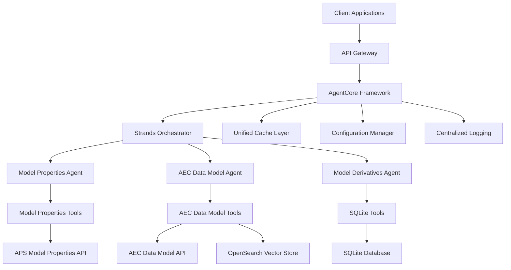

# Design Document

## Overview

This design outlines the migration of three existing Autodesk Data agents from standalone FastAPI applications to a unified AgentCore and Strands-based architecture. The solution will consolidate the ACC Model Properties Assistant, AEC Data Model Assistant, and APS Model Derivatives Assistant into a single deployable model while maintaining all existing functionality and improving scalability.

The current architecture consists of three separate FastAPI servers, each with their own agent implementations, caching mechanisms, and tool sets. The new architecture will use AgentCore as the foundational framework and Strands for agent orchestration, providing a unified deployment model with improved maintainability and scalability.

## Architecture

### High-Level Architecture



### Core Components

1. **AgentCore Framework**: The foundational layer that provides common services like authentication, logging, configuration management, and health monitoring.

2. **Strands Orchestrator**: Manages agent lifecycle, routing requests to appropriate agents, and handling inter-agent communication.

3. **Agent Implementations**: Three specialized agents that maintain the existing functionality while conforming to the new architecture.

4. **Unified Tool Registry**: A centralized registry for all agent tools, enabling reusability and consistent management.

5. **Configuration Manager**: Centralized configuration handling for all agents and their dependencies.

## Components and Interfaces

### AgentCore Framework

The AgentCore framework will provide the following core services:

```python
class AgentCore:
    def __init__(self, config: CoreConfig):
        self.config = config
        self.auth_manager = AuthenticationManager()
        self.logger = StructuredLogger()
        self.health_monitor = HealthMonitor()
        self.cache_manager = CacheManager()
    
    async def initialize(self) -> None:
        """Initialize all core services"""
        
    async def shutdown(self) -> None:
        """Graceful shutdown of all services"""
```

### Strands Orchestrator

The Strands orchestrator will manage agent routing and lifecycle:

```python
class StrandsOrchestrator:
    def __init__(self, agent_core: AgentCore):
        self.agent_core = agent_core
        self.agents: Dict[str, BaseAgent] = {}
        self.router = AgentRouter()
    
    async def register_agent(self, agent_type: str, agent: BaseAgent) -> None:
        """Register an agent with the orchestrator"""
        
    async def route_request(self, request: AgentRequest) -> AgentResponse:
        """Route request to appropriate agent"""
```

### Base Agent Interface

All agents will implement a common interface:

```python
class BaseAgent(ABC):
    def __init__(self, agent_core: AgentCore, tools: List[BaseTool]):
        self.agent_core = agent_core
        self.tools = tools
        self.llm = self._create_llm()
    
    @abstractmethod
    async def process_prompt(self, request: AgentRequest) -> AgentResponse:
        """Process user prompt and return response"""
    
    @abstractmethod
    def get_agent_type(self) -> str:
        """Return the agent type identifier"""
```

### Tool Registry

A centralized tool registry will manage all agent tools:

```python
class ToolRegistry:
    def __init__(self):
        self._tools: Dict[str, BaseTool] = {}
        self._tool_categories: Dict[str, List[str]] = {}
    
    def register_tool(self, tool: BaseTool, category: str) -> None:
        """Register a tool in the registry"""
        
    def get_tools_for_agent(self, agent_type: str) -> List[BaseTool]:
        """Get tools assigned to specific agent type"""
```

### API Gateway

The API gateway will maintain backward compatibility while routing to the new architecture:

```python
class APIGateway:
    def __init__(self, strands: StrandsOrchestrator):
        self.strands = strands
        self.app = FastAPI()
        self._setup_routes()
    
    def _setup_routes(self) -> None:
        """Setup backward-compatible API routes"""
        
    async def handle_prompt(self, payload: PromptPayload, agent_type: str) -> dict:
        """Handle incoming prompt requests"""
```

## Data Models

### Core Request/Response Models

```python
@dataclass
class AgentRequest:
    agent_type: str
    prompt: str
    context: Dict[str, Any]
    authentication: AuthContext
    metadata: Dict[str, Any]

@dataclass
class AgentResponse:
    responses: List[str]
    metadata: Dict[str, Any]
    execution_time: float
    agent_type: str

@dataclass
class AuthContext:
    access_token: str
    project_id: Optional[str] = None
    version_id: Optional[str] = None
    element_group_id: Optional[str] = None
    urn: Optional[str] = None
```

### Configuration Models

```python
@dataclass
class CoreConfig:
    aws_region: str
    bedrock_model_id: str
    opensearch_endpoint: str
    cache_directory: str
    log_level: str
    health_check_interval: int

@dataclass
class AgentConfig:
    agent_type: str
    enabled: bool
    tools: List[str]
    specific_config: Dict[str, Any]
```

### Vector Store Migration

The AEC Data Model agent will migrate from FAISS to OpenSearch:

```python
class OpenSearchVectorStore:
    def __init__(self, opensearch_client: OpenSearch, index_name: str):
        self.client = opensearch_client
        self.index_name = index_name
        self.embeddings = BedrockEmbeddings()
    
    async def add_documents(self, documents: List[Document]) -> None:
        """Add documents to OpenSearch index"""
        
    async def similarity_search(self, query: str, k: int = 8) -> List[Document]:
        """Perform similarity search using OpenSearch"""
```

## Error Handling

### Centralized Error Management

```python
class ErrorHandler:
    def __init__(self, logger: StructuredLogger):
        self.logger = logger
    
    async def handle_agent_error(self, error: Exception, context: AgentRequest) -> AgentResponse:
        """Handle agent-specific errors with context"""
        
    async def handle_tool_error(self, error: Exception, tool_name: str) -> None:
        """Handle tool execution errors"""
```

### Error Response Format

All errors will maintain backward compatibility with existing error formats while providing enhanced debugging information:

```python
@dataclass
class ErrorResponse:
    error_code: str
    message: str
    details: Dict[str, Any]
    trace_id: str
    timestamp: datetime
```

## Testing Strategy

### Unit Testing

1. **Agent Tests**: Test each agent's core functionality independently
2. **Tool Tests**: Test individual tools with mocked dependencies
3. **Integration Tests**: Test agent-tool interactions
4. **Configuration Tests**: Test configuration loading and validation

### Integration Testing

1. **End-to-End Tests**: Test complete request flows through the system
2. **API Compatibility Tests**: Ensure backward compatibility with existing clients
3. **Performance Tests**: Validate response times and resource usage
4. **Error Handling Tests**: Test error scenarios and recovery

### Test Structure

```python
class TestModelPropertiesAgent:
    async def test_create_index(self):
        """Test index creation functionality"""
        
    async def test_query_execution(self):
        """Test query execution with various inputs"""
        
    async def test_error_handling(self):
        """Test error scenarios and responses"""

class TestStrandsOrchestrator:
    async def test_agent_routing(self):
        """Test request routing to correct agents"""
        
    async def test_agent_registration(self):
        """Test agent registration and discovery"""
```

### Migration Testing

1. **Parallel Testing**: Run both old and new systems in parallel during migration
2. **Response Comparison**: Compare responses between old and new implementations
3. **Performance Benchmarking**: Ensure new system meets or exceeds performance requirements
4. **Load Testing**: Validate system behavior under various load conditions

## Deployment Architecture

### Container Structure

```dockerfile
# Multi-stage build for optimized deployment
FROM python:3.11-slim as base
# Install dependencies and setup environment

FROM base as production
# Copy application code and configuration
# Setup entrypoint for AgentCore initialization
```

### Configuration Management

```yaml
# config/production.yaml
core:
  aws_region: "us-east-1"
  bedrock_model_id: "anthropic.claude-3-5-sonnet-20241022-v2:0"
  opensearch_endpoint: "${OPENSEARCH_ENDPOINT}"
  cache_directory: "/app/cache"
  log_level: "INFO"

agents:
  model_properties:
    enabled: true
    tools: ["create_index", "list_index_properties", "query_index", "execute_jq_query"]
  
  aec_data_model:
    enabled: true
    tools: ["execute_graphql_query", "get_element_categories", "execute_jq_query", "find_related_property_definitions"]
    
  model_derivatives:
    enabled: true
    tools: ["sql_database_toolkit"]
```

### Health Monitoring

```python
class HealthMonitor:
    async def check_agent_health(self, agent_type: str) -> HealthStatus:
        """Check health of specific agent"""
        
    async def check_dependencies(self) -> Dict[str, HealthStatus]:
        """Check health of external dependencies"""
        
    async def get_system_metrics(self) -> SystemMetrics:
        """Get system performance metrics"""
```