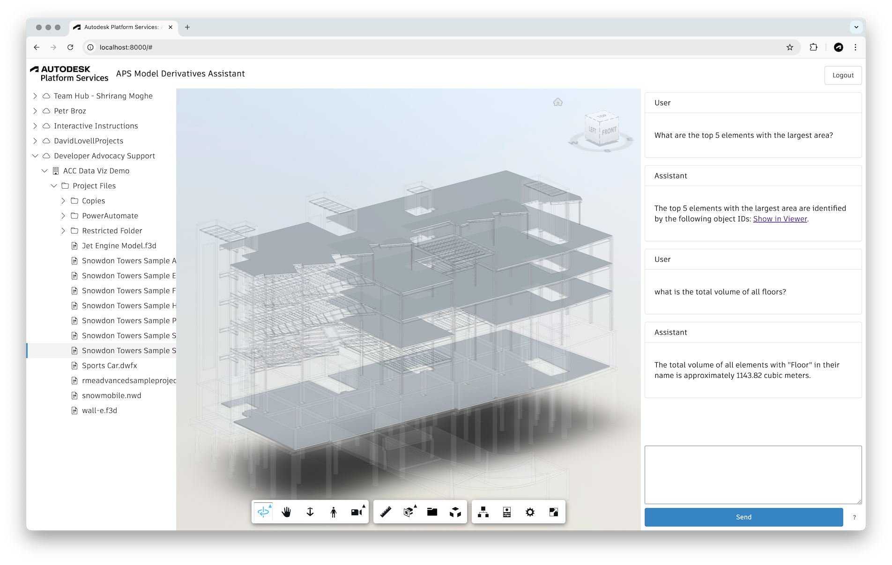

# aps-design-assistant

Experimental chatbot for querying design data in [Autodesk Construction Cloud](https://construction.autodesk.com/) using custom [Amazon Bedrock AgentCore](https://aws.amazon.com/bedrock/agentcore) and [Autodesk Platform Services](https://aps.autodesk.com).



## How does it work?

For any design selected in the frontend, the application extracts its various properties using the [Model Derivatives API](https://aps.autodesk.com/en/docs/model-derivative/v2/developers_guide/overview/), and caches the data in a local [sqlite](https://www.sqlite.org) database. Then, the application uses a [Strands Agents](https://strandsagents.com/latest) to query the database based on user prompts.

## Development

### Prerequisites

- Python 3.13 and [uv](https://github.com/astral-sh/uv)
- Autodesk Platform Services application (must be of type _Desktop, Mobile, Single-Page App_)
- Amazon Bedrock AgentCore

### Setup

- Create virtual environment: `uv venv && source .venv/bin/activate`
- Install dependencies: `uv sync`
- Configure your AWS credentials
- Setup AgentCore Memory: `python scripts/create_agentcore_memory.py SomeMemoryName`
- Set the generated memory ID as an environment variable: `export MEMORY_ID="SomeMemoryName-abcxyz"`

### Try it out

#### Locally running agent with a simple website

1. Add the APS client ID `YmHvRac8ZID6GHVY3R9skAcVZ8joHmyYT1RH7mvic7kEpTM9` as a custom integration to one of your ACC projects
2. Run the AgentCore Runtime locally: `uv run app.py`
3. Serve the static website under the _www_ folder: `python3 -m http.server -d www 8000`
4. Go to [http://localhost:8000](http://localhost:8000)
5. Login with your Autodesk credentials
6. Select a design file, and start asking questions

#### Invoking AgentCore Runtime from command line

1. Configure the AgentCore Runtime: `agentcore configure -e app.py`
2. Deploy to AgentCore Runtime: `agentcore launch`
3. Go to https://acc.autodesk.com, open one of your design files, and grab a design URN and an access token from the Network tab
4. Invoke the deployed agent:

```bash
export APS_DESIGN_URN="dXJuOmFkc2sud2lwcHJvZDpmcy5maWxlOnZmLldYSUJJTC1TUUp5LU5ua3FaVjNuSWc_dmVyc2lvbj0x"
export APS_ACCESS_TOKEN="eyJhbGci..."
export PROMPT="What are the top 5 elements with largest volume?"
agentcore invoke "{\"prompt\":\"$PROMPT\", \"aps_design_urn\":\"$APS_DESIGN_URN\",\"aps_access_token\":\"$APS_ACCESS_TOKEN\"}"
```
