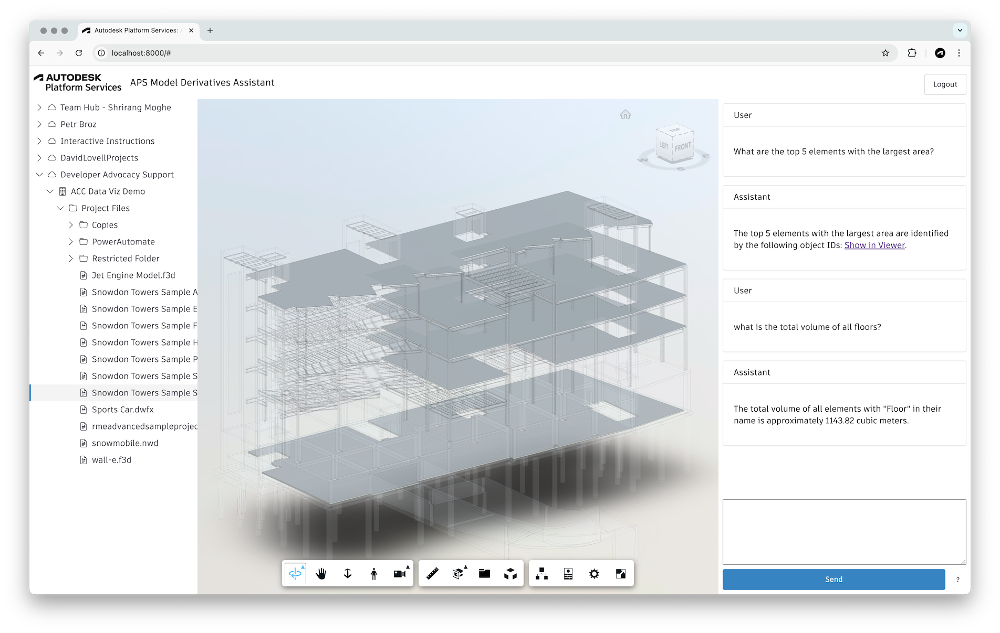

# APS Model Derivatives Assistant

Experimental chatbot for querying design data in [Autodesk Construction Cloud](https://construction.autodesk.com/) using custom [LangChain](https://www.langchain.com) agents and [Autodesk Platform Services](https://aps.autodesk.com) ([Model Derivatives API](https://aps.autodesk.com/en/docs/model-derivative/v2/developers_guide/overview/)).

## How does it work?

For any design selected in the frontend, the application extracts its various properties using the [Model Derivatives API](https://aps.autodesk.com/en/docs/model-derivative/v2/developers_guide/overview/), and caches the data in a local [sqlite](https://www.sqlite.org/) database. Then, the application uses a [LangGraph agent](https://python.langchain.com/docs/how_to/migrate_agent/) with built-in tools for querying the database based on user prompts.

## Usage

Login with your Autodesk credentials, select one of your design files in ACC, and try some of the prompts below:

> what are the top 5 elements with the largest area?

> give me the list of IDs of all wall elements

> what is the average height of doors?

> what is the sum of volumes of all floors?

## Development

### Prerequisites

- [APS application](https://aps.autodesk.com/en/docs/oauth/v2/tutorials/create-app/) of the _Desktop, Mobile, Single-Page App_ type
- [Amazon Bedrock](https://aws.amazon.com/bedrock/) access with Claude 3.5 Sonnet model enabled
- [Python 3.x](https://www.python.org/downloads/) (tested with version 3.13)

### Setup

- Clone the repository
- Initialize and activate a virtual environment: `python3 -m venv .venv && source .venv/bin/activate`
- Install Python dependencies: `pip install -r requirements.txt`
- Update [static/config.js](static/config.js) with your APS client ID and callback URL
- Configure AWS credentials:
  - Set up AWS credentials in your environment or AWS credentials file
  - Ensure you have access to the Claude 3.5 Sonnet model in your AWS Bedrock account
- Run the dev server: `python server.py`
- Open http://localhost:8000 in the browser